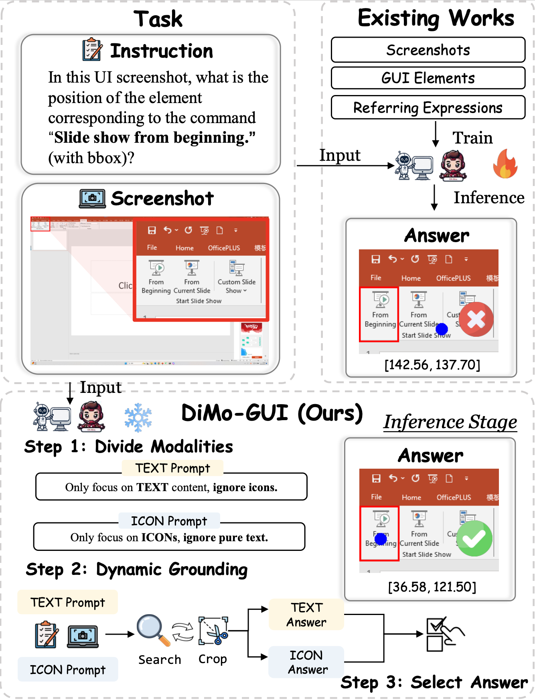
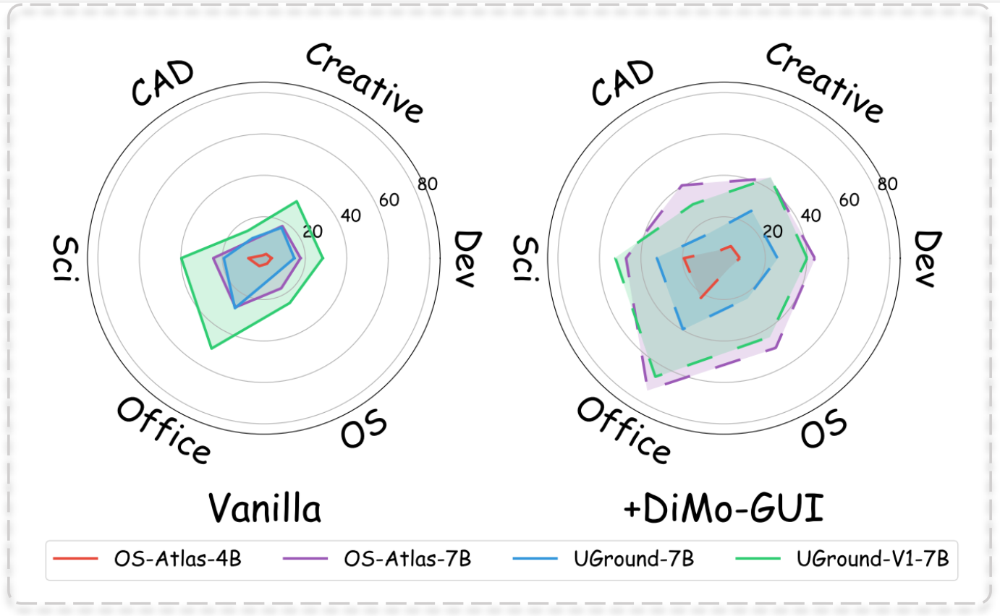
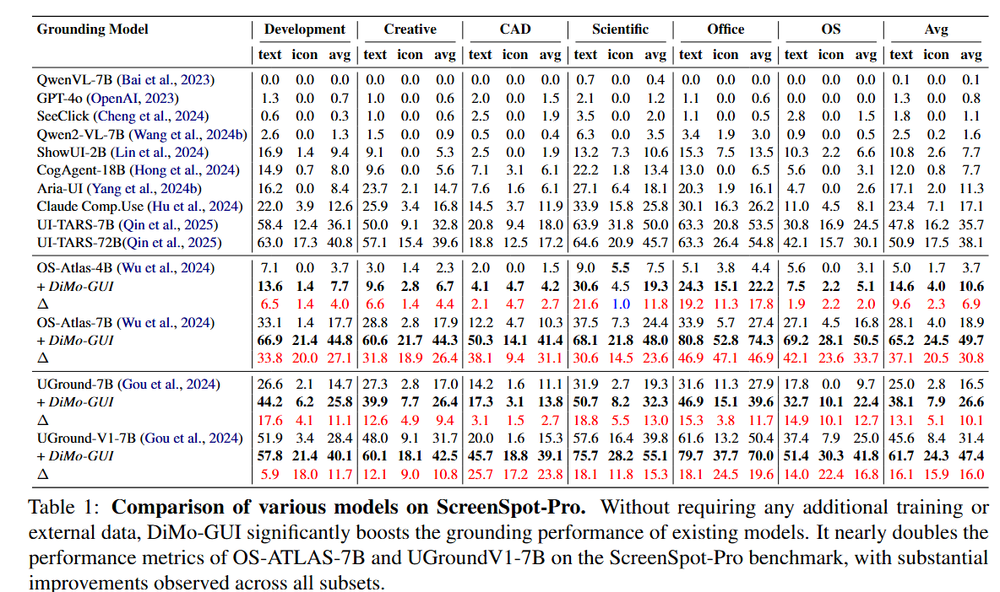
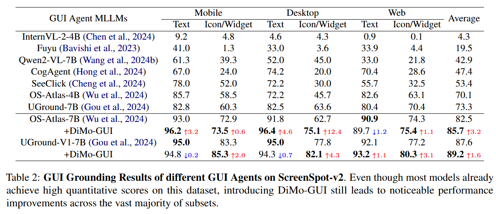
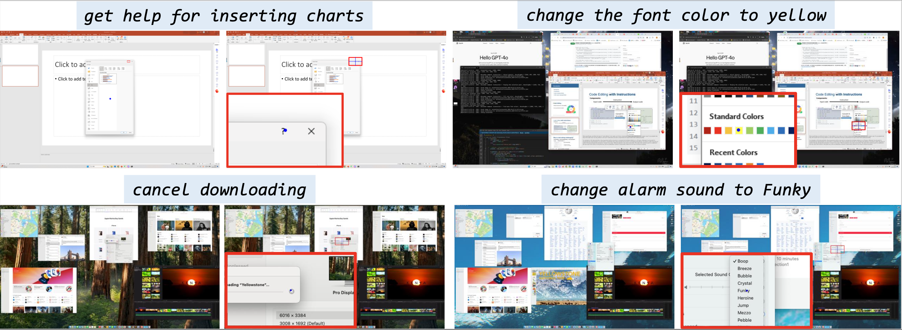
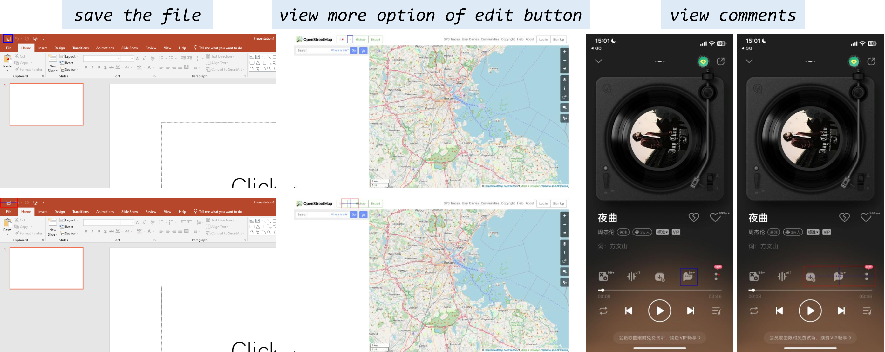

<p align="center" width="100%">
<!-- <a target="_blank"></a>
</p> -->

# DiMo-GUI: Advancing Test-time Scaling in GUI Grounding via Modality-Aware Visual Reasoning


<div align="center">
  <div class="is-size-5 publication-authors" style="font-size: 18px;">
    <!-- Paper authors -->
    <span class="author-block">
      <a href="https://wuhang03.github.io/" target="_blank">Hang Wu</a><sup>1,3</sup>,</span>
    <span class="author-block">
      <a href="SECOND AUTHOR PERSONAL LINK" target="_blank">Hongkai Chen</a><sup>3†</sup>,</span>
    <span class="author-block">
      <a href="https://vanoracai.github.io/" target="_blank">Yujun Cai</a><sup>2</sup>,</span>
    <span class="author-block">
      <a href="THIRD AUTHOR PERSONAL LINK" target="_blank">Chang Liu</a><sup>3</sup>,</span>
    <span class="author-block">
      <a href="THIRD AUTHOR PERSONAL LINK" target="_blank">Qingwen Ye</a><sup>3</sup>,</span>
    <span class="author-block">
      <a href="https://faculty.ucmerced.edu/mhyang/" target="_blank">Ming-Hsuan Yang</a><sup>1</sup>,</span>
    <span class="author-block">
      <a href="https://wangywust.github.io/" target="_blank">Yiwei Wang </a><sup>1</sup>,</span>
  </div>

  <div class="is-size-5 publication-authors" style="font-size: 18px;">
    <span class="author-block"><sup>1</sup>University of California, Merced, 
      <sup>2</sup>The University of Queensland, 
      <br><sup>3</sup>vivo Mobile Communication Co., Ltd
    </span>
    <span class="eql-cntrb"><small><br><sup>†</sup>Indicates Corresponding Author</small></span>
  </div>
</div>


<div style='display: flex; gap: 0.25rem; justify-content: center; text-align: center;' align="center">
  <!-- <a href='LICENCE'></a> -->
  <a href='https://wuhang03.github.io/DiMo-GUI-homepage/'></a>
  <a href='https://www.techrxiv.org/users/933923/articles/1304524-dimo-gui-advancing-test-time-scaling-in-gui-grounding-via-modality-aware-visual-reasoning'></a>
  <a href='https://wuhang03.github.io/DiMo-GUI-homepage/'></a>
  <!-- <a href='https://twitter.com/Leon_L_S_C'></a> -->
</div>

## 🔥 Update
<!-- * [2024-04-05]: ⭐️⭐️⭐️ VCD is selected as Poster Highlight in CVPR 2024! (Top 11.9% in accepted papers)
* [2023-11-29]: ⭐️ Paper of VCD online. Check out [this link](https://arxiv.org/abs/2311.16922) for details. -->
* [2025-06-18]: 🚀 Paper released on TechRxiv.
* [2025-06-11]: 🚀 Codes released.

## 🎯 Overview
<div align="center">
    
</div>

- We propose **DiMo-GUI**, a training-free framework that can be seamlessly integrated as a plug-and-play component into any GUI agent. Without requiring additional training or external data, DiMo-GUI effectively enhances grounding performance across various GUI tasks.
- DiMo-GUI introduces three key innovations: 
  1. A divide-and-conquer strategy that separates text and icon components for targeted processing.
  2. A progressive zoom-in mechanism to increasingly focus on the target region.
  3. A dynamic halting system that enables timely decision-making and early stopping to reduce overthinking and unnecessary computational cost.

<div align="center">
    
</div>

- Extensive and comprehensive experiments demonstrate that DiMo-GUI can significantly enhance the grounding performance of various GUI agents across multiple benchmarks with minimal computational overhead, showcasing the effectiveness and generalizability of the proposed framework.


## 🕹️ Usage
### Environment Setup
```bash
conda env create -n dimo-gui
source activate dimo-gui
cd DiMo-GUI
pip install -r requirements.txt
```


Note that the transformers version required by osatlas-4b is different from others, you need to run the following command to run osatlas-4b:
```bash
pip install transformers==4.37.2
```


### Data Preparation
You can download the **ScreenSpot-Pro** dataset from this huggingface [link](https://huggingface.co/datasets/likaixin/ScreenSpot-Pro), or use the download code below:

```bash
huggingface-cli download --resume-download  --repo-type dataset likaixin/ScreenSpot-Pro --local-dir ./data/pro
```

You can obtain the **ScreenSpot-V2** dataset from this [link](https://huggingface.co/datasets/likaixin/ScreenSpot-v2-variants), and refer to this [issue](https://github.com/likaixin2000/ScreenSpot-Pro-GUI-Grounding/issues/6)

Make sure you put the data under `./data` path, or you may need to change the bash script.

### Run DiMo-GUI

Use the shell script to run DiMo-GUI:
```bash
bash run_ss_pro.sh
bash run_ss_v2.sh
```

You can change the parameters like `models` and `max_iter` to run different experiments.

We provide the json file of experimental results in the paper in `results` folder.

## 🏅 Experiments
- **Comparison of various models on ScreenSpot-Pro.**
<div align="center">
    
</div>

- **Comparison of various models on ScreenSpot-V2**
<div align="center">
    
</div>


- **Please refer to [our paper]() for detailed experimental results.**


## 📌 Examples
<div align="center">
    
</div>

- **Examples on ScreenSpot-Pro.** On the left is the original model's prediction, where the red box represents the ground truth and the blue dot indicates the predicted coordinates. On the right is the result after integrating DiMo-GUI, where the model is able to localize more accurately according to the instruction


<div align="center">
    
</div>

- **Examples on ScreenSpot-V2.** On the Screenspot benchmark, which features relatively low resolution and simple scenes, DiMo-GUI also enhances the model's localization capabilities.


## 📑 Citation
If you find our project useful, we hope you can star our repo and cite our paper as follows:
```

```


## 📝 Related Projects
Our repository is based on the following projects, we sincerely thank them for their great efforts and excellent work.
- [ScreenSpot-Pro](https://github.com/likaixin2000/ScreenSpot-Pro-GUI-Grounding): latest GUI grounding benchmark.
- [Iterative-Narrowing](https://github.com/ant-8/GUI-Grounding-via-Iterative-Narrowing): Iterative Narrowing for GUI grounding.
- [OS-Atlas](https://github.com/OS-Copilot/OS-Atlas) , [UGround](https://github.com/OSU-NLP-Group/UGround): SOTA GUI agents.

## License

This project is licensed under the terms of the Apache License 2.0.
You are free to use, modify, and distribute this software under the conditions of the license. See the LICENSE file for details.